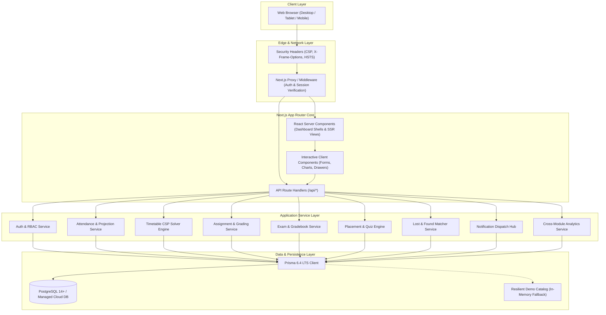
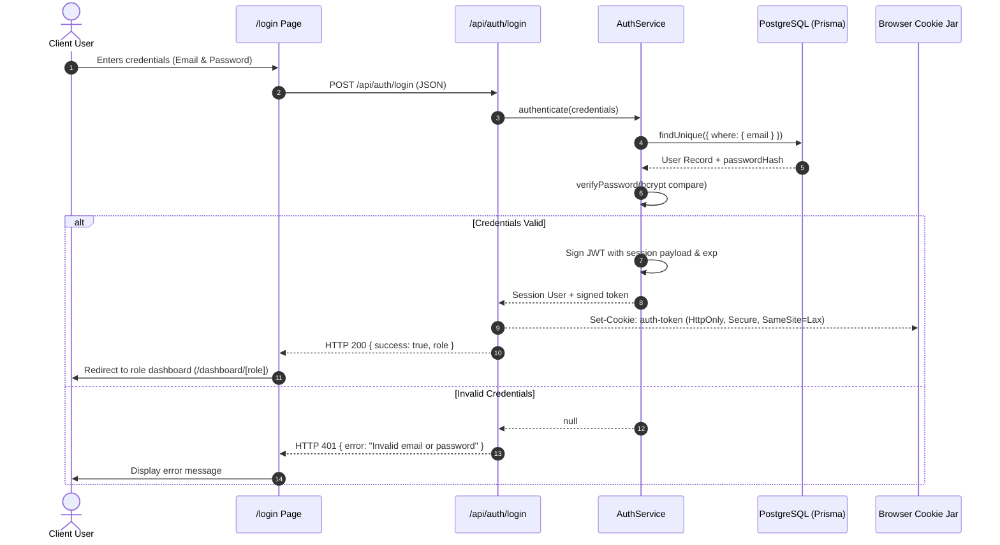
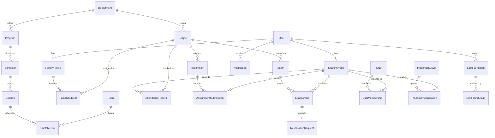
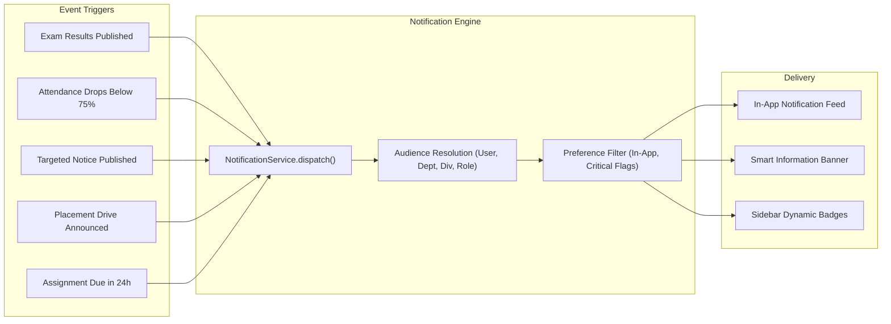
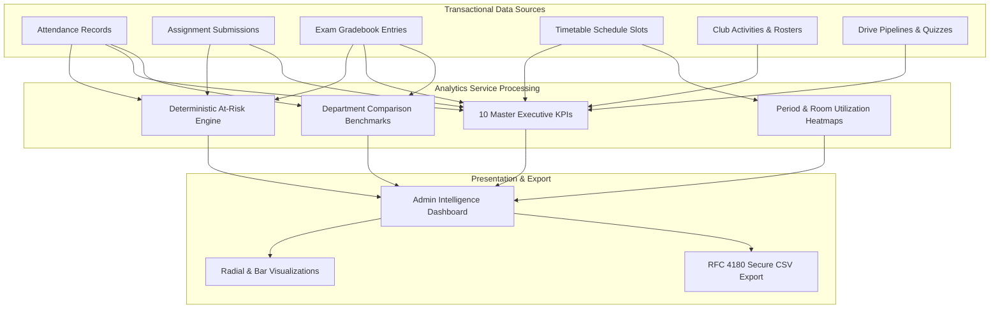
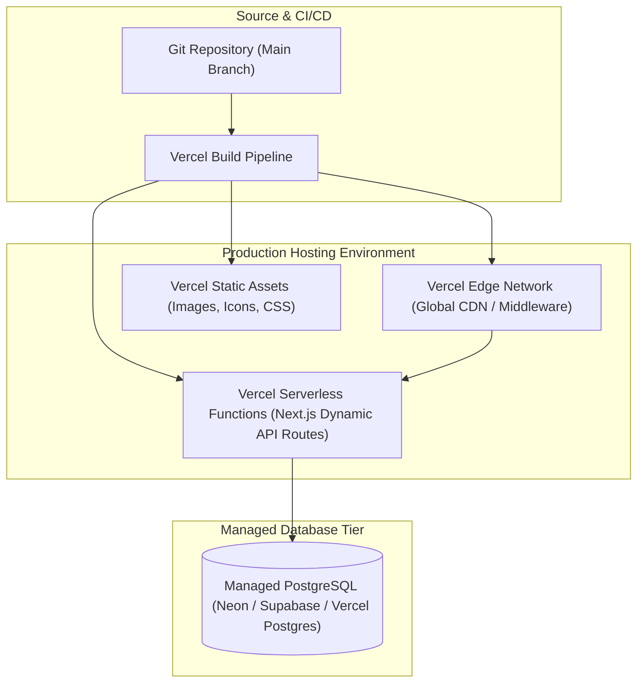

# Campus Connect — Technical Architecture & System Design Document

**System Name:** Campus Connect (All-in-One College Ecosystem)  
**Version:** 1.0 (Production Release)  
**Architecture Pattern:** Modular Next.js 16 Full-Stack App Router with Layered Domain Services  

---

## 1. System Architecture Overview

Campus Connect is built as a unified web application leveraging Next.js 16 App Router. It combines server-rendered React Server Components (RSC) for dashboard layouts, client components for rich interactive controls (Recharts, dynamic drawers, modals), and dynamic RESTful API route handlers backed by Prisma ORM and PostgreSQL.

### High-Level Architecture Diagram



---

## 2. Authentication & Session Architecture

Campus Connect employs a zero-trust stateless session model utilizing signed JSON Web Tokens (JWTs) generated via `jose` and stored in tamper-proof browser cookies.

### Authentication Flow



---

## 3. Server-Side RBAC & Authorization Architecture

Authorization is enforced on the server for every single API route and server action. The system defines 5 discrete roles:

```
[STUDENT] ────► Read personal records, submit assignments, take quizzes, view results/transcript
[FACULTY] ────► Manage registers, grade assignments, enter exam gradebooks, view own timetable
[ADMIN] ──────► Academic setup, faculty mapping, rooms, CSP timetable solver, exam lock, analytics
[CLUB_COORD] ─► Club roster, member approvals, activity planning, club analytics
[PLACEMENT] ──► Manage drives, evaluate eligibility, track hiring pipeline, placement analytics
```

### API Request Flow with RBAC Guard

```mermaid
flowchart TD
    Req[Incoming HTTP Request] --> MIddleware[Edge Middleware /proxy.ts]
    MIddleware --> TokenCheck{Valid auth-token Cookie?}
    TokenCheck -- No --> RedirLogin[Redirect to /login or HTTP 401]
    TokenCheck -- Yes --> DecryptToken[Verify JWT Signature & Extract Role/UserId]
    DecryptToken --> RouteHandler[App Router Handler /api/*]
    RouteHandler --> RBACGuard[checkRole(allowedRoles)]
    RBACGuard --> RoleMatch{Role in Allowed List?}
    RoleMatch -- No --> Ret403[Return HTTP 403 Forbidden]
    RoleMatch -- Yes --> InputVal[Validate Body/Query with Zod]
    InputVal --> ValCheck{Valid Input?}
    ValCheck -- No --> Ret400[Return HTTP 400 Bad Request]
    ValCheck -- Yes --> IDORCheck{Server-Side Ownership Verified?}
    IDORCheck -- No --> Ret403_IDOR[Return HTTP 403 Forbidden]
    IDORCheck -- Yes --> ServiceLogic[Invoke Domain Service]
    ServiceLogic --> Ret200[Return HTTP 200/201 JSON Response]
```

---

## 4. Database Relationship Architecture

The normalized relational database schema contains 24+ core tables organized into logical clusters:



---

## 5. Domain Engines & Algorithmic Modules

### A. AI/Constraint-Based Timetable Generator (CSP Solver)
The Timetable Engine formulates scheduling as a formal Constraint Satisfaction Problem:
- **Variables:** Subject lecture hours required per division per week.
- **Domains:** Time slots (Monday–Friday, Periods 1–6) and suitable physical rooms/laboratories.
- **Hard Constraints:**
  1. No division has two classes in the same period.
  2. No faculty is scheduled in two places simultaneously.
  3. No room hosts two simultaneous sessions.
  4. Practical sessions require laboratory facility types.
- **Heuristics:** Minimum Remaining Values (MRV) variable selection, Degree heuristic tie-breaking, and Forward Checking domain pruning.

### B. Attendance Projection Engine
Calculates real-time attendance dynamics:
$$\text{Current Percentage} = \left(\frac{\text{Attended Classes}}{\text{Total Conducted Classes}}\right) \times 100$$
$$\text{Classes Needed to Reach 75\%} = \max\left(0, \left\lceil \frac{0.75 \times \text{Total} - \text{Attended}}{1 - 0.75} \right\rceil\right) = \max\left(0, \lceil 3 \times \text{Total} - 4 \times \text{Attended} \rceil\right)$$

### C. Lost & Found Multi-Factor Matching Engine
When an item is reported as `LOST` or `FOUND`, the matching engine executes a deterministic similarity pipeline:
- **Category Match:** 40 points for exact match (`ELECTRONICS`, `DOCUMENTS`, `KEYS`, etc.).
- **Temporal Proximity:** Up to 30 points inversely proportional to date difference ($\le 1 \text{ day} = 30\text{ pts}$, $\le 3 \text{ days} = 20\text{ pts}$, $\le 7 \text{ days} = 10\text{ pts}$).
- **Lexical Overlap:** Up to 30 points based on tokenized keyword Jaccard similarity across title, location, and description.
- Items scoring $\ge 50$ are flagged as potential matches.

### D. Placement Readiness Scoring Rubric
A composite 0–100 benchmark evaluating candidate employability:
- **30% Academic Standing:** Scaled proportionally from cumulative CGPA (10.0 = 30 pts).
- **20% Attendance Discipline:** Scaled from overall attendance percentage (100% = 20 pts).
- **20% Technical Assessment:** Average score attained across completed preparation quizzes.
- **15% Assignment Punctuality:** Ratio of on-time submissions to total assignments.
- **15% Extracurricular Leadership:** Active club memberships and organized campus activities.

### E. Exam Management & CGPA Calculation
- **10-Point Grade Scale:** $\ge 90\% \rightarrow \text{A+} (10.0)$, $\ge 80\% \rightarrow \text{A} (9.0)$, $\ge 70\% \rightarrow \text{B+} (8.0)$, $\ge 60\% \rightarrow \text{B} (7.0)$, $\ge 50\% \rightarrow \text{C} (6.0)$, $\ge 40\% \rightarrow \text{D} (5.0)$, $< 40\% \rightarrow \text{F} (0.0)$.
- **SGPA Calculation:** $\frac{\sum (\text{Subject Credits} \times \text{Grade Points})}{\sum \text{Subject Credits}}$
- **CGPA Calculation:** Cumulative weighted grade point average across all completed semesters.

---

## 6. Notification Dispatch Architecture



---

## 7. Analytics & Executive Intelligence Flow



---

## 8. Deployment & Infrastructure Architecture


