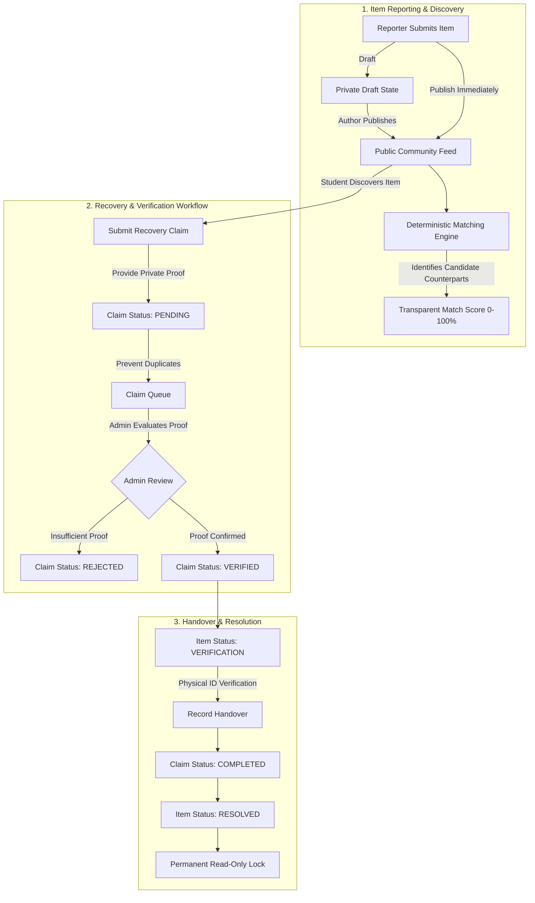

# Phase 11 — Lost & Found Community Board & Claim Verification

## Overview

The **Campus Connect Lost & Found System** provides an institutional, zero-trust community board and recovery ecosystem tailored for modern college campuses. Built entirely on Next.js 16 App Router, TypeScript, Tailwind CSS, Prisma, and PostgreSQL, this module replaces disorganized messaging groups with a structured, verified lifecycle:

$$\text{Report (Lost/Found)} \longrightarrow \text{Publish/Draft} \longrightarrow \text{Deterministic Potential Match} \longrightarrow \text{Evidence-Backed Claim} \longrightarrow \text{Admin Verification} \longrightarrow \text{Physical Handover} \longrightarrow \text{Read-Only Resolved}$$

---

## 1. Architecture & Core Workflow

The system provides separate, secure workflows for students, moderators/administrators, and physical campus recovery desks:

---

## 2. Database Models & Schema Extensions

Upgraded normalized models in `prisma/schema.prisma`:

### `LostFoundItem`
- **`id`**: Unique primary key UUID.
- **`referenceNumber`**: Deterministic unique public case identifier formatted as `LF-YYYY-XXXX`.
- **`type`**: Enum `LostFoundType` (`LOST` | `FOUND`).
- **`title`**: String (3–100 characters).
- **`category`**: Enum `LostFoundCategory` (14 categories: `ELECTRONICS`, `ID_DOCUMENT`, `STUDENT_CARD`, `BOOK`, `BAG`, `CLOTHING`, `KEYS`, `JEWELLERY`, `ACCESSORY`, `STATIONERY`, `SPORTS`, `WALLET`, `WATER_BOTTLE`, `OTHER`).
- **`description`**: String (10–2000 characters).
- **`status`**: Enum `LostFoundStatus` (`DRAFT`, `PUBLISHED`, `CLAIM_PENDING`, `VERIFICATION`, `RESOLVED`, `CLOSED`, `EXPIRED`, `ARCHIVED`, `REJECTED`).
- **`location`**: String representing campus building/zone (e.g. "Central Library Reading Hall", "Main Auditorium Lobby").
- **`dateLostFound`**: Date string when item was misplaced/discovered.
- **`timeLostFound`**: Optional approximate time.
- **`contactPreference`**: Default `CAMPUS_PORTAL` preventing leak of phone numbers/emails.
- **`identifyingDetails`**: Non-public identifying marks (e.g., engravings, secret pocket items, serial snippets) used by reviewers.
- **`imageUrl`**: Secure validated image path.
- **`reporterId`**: Foreign key to `User`.
- **`resolvedAt`**, **`resolvedBy`**, **`resolutionNotes`**: Audit metadata populated upon case closure.

### `LostFoundClaim`
- **`id`**: Unique claim UUID.
- **`itemId`**: Foreign key to `LostFoundItem`.
- **`claimantId`**: Foreign key to `User`.
- **`claimStatement`**: Formal recovery statement describing how/when item was lost.
- **`verificationAnswers`**: Secret proof-of-ownership details submitted privately by the claimant.
- **`status`**: Enum `ClaimStatus` (`PENDING`, `UNDER_REVIEW`, `VERIFIED`, `APPROVED`, `REJECTED`, `WITHDRAWN`, `COMPLETED`).
- **`submittedAt`**, **`reviewedAt`**, **`reviewedBy`**, **`reviewerRemarks`**, **`resolvedAt`**: Full review audit trail.
- **Constraint**: `@@unique([itemId, claimantId])` strictly preventing duplicate active claims on the same case.

### `LostFoundAttachment`
- Normalized reference storing `fileUrl`, `fileName`, `fileSize`, and `mimeType` with path traversal sanitization.

### `LostFoundMatch`
- Caches deterministic potential counterpart matching relations (`lostItemId`, `foundItemId`, `matchScore`, `matchingFactors`, `status`).

---

## 3. Potential Matching Engine

The matching engine (`LostFoundService.findMatchesForItem`) implements a multi-factor deterministic scoring algorithm that evaluates counter-type items (LOST $\leftrightarrow$ FOUND) on a 0–100 scale:

| Factor | Weight | Scoring Logic |
| :--- | :--- | :--- |
| **Category Match** | **30%** | Exact match on `LostFoundCategory` enum (e.g., both `WATER_BOTTLE`). |
| **Keyword Similarity** | **20%** | Tokenized title, description, and characteristics filtered against campus stopwords. |
| **Location Proximity** | **20%** | Tokenized overlap of campus buildings/zones (e.g. "Library", "Canteen"). |
| **Date Proximity** | **15%** | $\le 1$ day: 15 pts; $\le 3$ days: 10 pts; $\le 7$ days: 5 pts. |
| **Color & Brand Keywords** | **15%** | Cross-matched distinctive brands/colors (e.g. "Hydro Flask", "Blue", "Sony"). |

### Deterministic Integrity & Anti-False-Positive Rules
1. **No Automatic Ownership**: Matches are explicitly branded as **Potential Matches** with confidence scores and reasoning checklists (e.g., "✓ Identical category", "✓ Location proximity"). The engine **never** auto-approves or transfers ownership.
2. **Opposite-Type Only**: LOST items are only matched against FOUND items and vice-versa.
3. **Active State Only**: Drafts, archived, rejected, and resolved items are strictly excluded from candidate matching.

---

## 4. Claim Verification & Anti-Fraud Architecture

1. **Information Asymmetry**: Distinguishing details (such as serial snippets, inner wallet contents, or private engravings) are hidden from public item feeds. Claimants must independently declare these in their `verificationAnswers`.
2. **Self-Approval Prohibition**: Server-side RBAC strictly blocks students from reviewing or approving their own claims (`403 Forbidden`). Only authorized campus administrators (`Role.ADMIN`) can review verification proofs.
3. **Anti-Self-Claim**: A student cannot submit a claim on an item they themselves reported.
4. **Duplicate Prevention**: The system enforces unique active claims per item-claimant pair (`409 Conflict`).
5. **Private Access Control**: Unrelated students cannot view private claim verification details submitted by other students.
6. **Read-Only Lockdown**: Once an item is marked `RESOLVED`, all subsequent claims and modifications are permanently rejected.

---

## 5. File & Image Security

Uploaded attachments (`/api/lost-found/upload`) pass strict server-side validation (`LostFoundService.validateUploadedAttachment`):
- **Whitelisted Extensions**: `.jpg`, `.jpeg`, `.png`, `.webp`.
- **Blocked Executables & Scripts**: `.exe`, `.bat`, `.sh`, `.cmd`, `.js`, `.vbs`, `.php`, `.py`, `.bin`, `.msi`.
- **Path Traversal Protection**: Rejection of filenames containing `..`, `/`, `\`.
- **Max File Size**: 5MB hard limit enforced before disk persistence.
- **Sanitized Filenames**: Alphanumeric timestamped naming ensuring no internal filesystem paths are exposed to the client.

---

## 6. HTTP API Specification

| Method | Endpoint | Access | Description |
| :--- | :--- | :--- | :--- |
| `GET` | `/api/lost-found` | Public/Auth | Query published feed with type, category, status, and keyword search filters. |
| `POST` | `/api/lost-found` | Student/Admin | Create a new LOST or FOUND report (in DRAFT or PUBLISHED status). |
| `GET` | `/api/lost-found/[id]` | Public/Auth | Retrieve case details, claims count, and potential matches. |
| `PATCH` | `/api/lost-found/[id]` | Author/Admin | Update report details (prevented if resolved). |
| `POST` | `/api/lost-found/[id]/publish` | Author/Admin | Publish a draft report to the community feed. |
| `POST` | `/api/lost-found/[id]/archive` | Author/Admin | Archive an active report. |
| `GET` | `/api/lost-found/my-reports` | Authenticated | Retrieve personal reported cases. |
| `GET` | `/api/lost-found/[id]/matches` | Authenticated | Retrieve deterministic potential matches and match scores. |
| `GET` | `/api/lost-found/[id]/claims` | Author/Admin | Retrieve claims submitted against a specific item. |
| `POST` | `/api/lost-found/[id]/claims` | Student | Submit proof-of-ownership recovery claim. |
| `GET` | `/api/lost-found/claims` | Student/Admin | List user's claims or admin verification queue. |
| `GET` | `/api/lost-found/claims/[id]` | Claimant/Admin | Inspect claim verification details. |
| `POST` | `/api/lost-found/claims/[id]/review` | Admin Only | Review claim to `UNDER_REVIEW`, `VERIFIED`, or `REJECTED`. |
| `POST` | `/api/lost-found/claims/[id]/withdraw` | Claimant | Withdraw a pending or under-review claim. |
| `POST` | `/api/lost-found/[id]/handover` | Admin Only | Record physical handover and transition claim to `COMPLETED`. |
| `POST` | `/api/lost-found/[id]/resolve` | Admin/Reporter | Mark case resolved with resolution notes. |
| `GET` | `/api/lost-found/analytics` | Authenticated | Retrieve institutional or personal lost & found analytics. |
| `POST` | `/api/lost-found/upload` | Authenticated | Securely upload and validate photo attachment. |
| `GET` | `/api/notifications` | Authenticated | Retrieve user notifications including lost & found updates. |

---

## 7. UI/UX Implementation

All components follow the Campus Connect design system:
1. **Student Lost & Found Hub (`student-lost-found-hub.tsx`)**:
   - Filter chips for `ALL`, `LOST`, and `FOUND`.
   - Category selector with custom Lucide icons.
   - Real-time keyword search with instant debounced filtering.
   - Status badges with distinct color semantics (`PUBLISHED` green, `CLAIM_PENDING` amber, `RESOLVED` blue).
2. **Report Creation Wizard (`student-report-wizard.tsx`)**:
   - Multi-step structured reporting workflow.
   - Item classification (Lost vs Found).
   - Category, location, date & time pickers.
   - Optional secure photo upload with drag-and-drop support.
   - Distinguishing details declaration.
   - Draft support allowing students to draft reports before publishing.
3. **Item Details & Claim Modal (`student-item-detail.tsx`)**:
   - Comprehensive case summary with photo preview.
   - Potential counterpart matches panel with percentage match meter and factor breakdown checklist.
   - Claim submission modal collecting claim statement and secret verification details.
4. **Student Reports & Claims Trackers**:
   - `student-my-reports.tsx`: Manage active reports, publish drafts, or archive items.
   - `student-claims-tracker.tsx`: Monitor claim verification progress, admin remarks, and handover instructions.
5. **Admin Governance & Claims Desk**:
   - `admin-lost-found-dashboard.tsx`: Institutional overview with metric cards and case moderation controls.
   - `admin-claims-desk.tsx`: Review claim evidence, approve verified claims, reject invalid claims, and log physical handovers.

---

## 8. Verification Results

### Automated Integration Tests (`vitest run tests/integration/lost-found.test.ts`)
- **52 / 52 dedicated Phase 11 tests PASSING**:
  - Validation schemas & input sanitization (10 tests)
  - File security & path traversal rejection (5 tests)
  - Report creation, reference numbers, draft isolation, & publishing (7 tests)
  - Ownership enforcement, archival, search, & category filters (6 tests)
  - Deterministic matching engine & factor explanation (5 tests)
  - Claim submission, duplicate prevention, & withdrawal (7 tests)
  - Admin claim review & anti-self-approval enforcement (5 tests)
  - Physical handover & read-only lock after resolution (5 tests)
  - Institutional & personal analytics calculation (2 tests)

### Cumulative Automated Tests (`vitest run`)
- **14 / 14 test suites PASSING**.
- **298 / 298 cumulative tests PASSING** (100% success rate, 0 regressions across Phases 1–11).

### Live HTTP API Verification (`node scripts/verify-api.mjs`)
- **355 / 355 live assertions PASSING** (57 dedicated Phase 11 assertions `LF1`–`LF34` + sub-assertions):
  - `LF1`: Student session authenticated with HTTP-only cookies
  - `LF2`: Admin session authenticated with HTTP-only cookies
  - `LF3`: Student creates LOST report (HTTP 201)
  - `LF3b`: Report created with type LOST
  - `LF3c`: Case reference number generated (`LF-2026-XXXX`)
  - `LF4`: Student creates FOUND report (HTTP 201)
  - `LF5`: DRAFT report is concealed from unauthorized public discovery feed
  - `LF6`: Author publishes draft report (HTTP 200)
  - `LF7`: Student browses published reports feed (HTTP 200)
  - `LF8`: Search and category filters operate properly (HTTP 200)
  - `LF9`: Author edits own report successfully (HTTP 200)
  - `LF10`: Non-author cannot edit another user's report (HTTP 403)
  - `LF11`: Server evaluates potential matches (HTTP 200)
  - `LF12`: Match score returned and bounded in 0-100 range
  - `LF13`: Match scoring is strictly deterministic
  - `LF14`: Student submits proof-of-ownership claim (HTTP 201)
  - `LF15`: Duplicate active claim rejected (HTTP 409 Conflict)
  - `LF16`: Student cannot access another user's private claim (HTTP 403/404)
  - `LF17`: Admin queries pending claims desk (HTTP 200)
  - `LF18`: Student self-approval strictly blocked (HTTP 403 Forbidden)
  - `LF19`: Admin approves verified claim (HTTP 200)
  - `LF20`: Claimant inspects updated claim status (HTTP 200)
  - `LF21`: Handover recorded and item marked resolved (HTTP 200)
  - `LF22`: Direct item resolution recorded (HTTP 200)
  - `LF23`: Resolved item is locked into read-only state (HTTP 400)
  - `LF24`: New claim rejected on resolved item (HTTP 400)
  - `LF25`: Student blocked from unauthorized admin resolve (HTTP 403)
  - `LF26`: Admin queries Lost & Found analytics (HTTP 200)
  - `LF27`: File security blocks executable upload (HTTP 400/403)
  - `LF28`: Notifications retrieved for claimant (HTTP 200)
  - `LF29`: Filtering by type=LOST returns only lost items
  - `LF30`: Status filtering returns only matching status items
  - `LF31`: Student queries personal reports (HTTP 200)
  - `LF32`: Student can withdraw pending claim (HTTP 200)
  - `LF33`: Student cannot submit claim on own report (HTTP 400)
  - `LF34`: Non-author cannot publish another user's draft (HTTP 403 Forbidden)

### TypeScript & Production Build Validation
- `npm run type-check`: **0 errors**.
- `npm run build`: **0 errors**, **95 routes compiled**.
