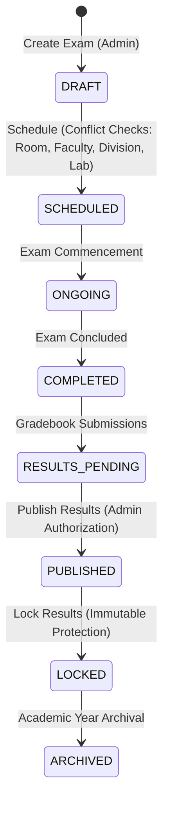

# Phase 15 — Exam Management, Gradebook, Results, GPA/CGPA & Academic Transcript

## 1. Overview & Architecture
Phase 15 completes the foundational academic examination gap in Campus Connect by introducing a normalized, deterministic, enterprise-grade examination lifecycle engine, faculty gradebook, multi-semester results engine, credit-weighted GPA/CGPA computation, formal academic transcript generator with RFC 4180 CSV & print-ready document exports, and audited revaluation workflow.

---

## 2. Exam Lifecycle & State Machine
The lifecycle of an examination is strictly controlled on the server:

- **Conflict Detection Engine**: Validates room collisions, faculty invigilation overlaps, division concurrency, minimum 30-minute exam duration, and enforces laboratory room type (`RoomType.LAB`) for practical viva/lab exams.
- **Lock Protection**: Exams in `LOCKED` status reject all gradebook updates, modifications, or casual deletions.

---

## 3. Gradebook & Deterministic Grading Calculation
- **Authoritative Grading Scale**: Standard 10-point university academic scale:
  - $A+ \ge 90\% \rightarrow 10.0$ Grade Points (Pass)
  - $A \ge 80\% \rightarrow 9.0$ Grade Points (Pass)
  - $B+ \ge 70\% \rightarrow 8.0$ Grade Points (Pass)
  - $B \ge 60\% \rightarrow 7.0$ Grade Points (Pass)
  - $C \ge 50\% \rightarrow 6.0$ Grade Points (Pass)
  - $D \ge 40\% \rightarrow 5.0$ Grade Points (Pass)
  - $F < 40\% \rightarrow 0.0$ Grade Points (Fail)
- **Absent Handling**: Candidates marked absent (`isAbsent: true`) are deterministically recorded with 0 marks obtained, grade `F`, and 0 grade points.
- **Input Validation**: Server enforces $0 \le \text{marksObtained} \le \text{maxMarks}$ and $\text{passingMarks} \le \text{maxMarks}$.

---

## 4. GPA & CGPA Computation

### Semester Grade Point Average (SGPA)
$$\text{SGPA} = \frac{\sum_{i=1}^{n} (\text{Credits}_i \times \text{GradePoint}_i)}{\sum_{i=1}^{n} \text{Credits}_i}$$

### Cumulative Grade Point Average (CGPA)
$$\text{CGPA} = \frac{\sum_{s=1}^{S} \sum_{i=1}^{n_s} (\text{Credits}_{s,i} \times \text{GradePoint}_{s,i})}{\sum_{s=1}^{S} \sum_{i=1}^{n_s} \text{Credits}_{s,i}}$$

### Degree Classifications
- $\text{CGPA} \ge 7.5$: **First Class with Distinction**
- $6.5 \le \text{CGPA} < 7.5$: **First Class**
- $5.5 \le \text{CGPA} < 6.5$: **Higher Second Class**
- $5.0 \le \text{CGPA} < 5.5$: **Second Class**
- $4.0 \le \text{CGPA} < 5.0$: **Pass Class**
- $\text{CGPA} < 4.0$: **Fail**

---

## 5. Candidate Eligibility & Zero-Trust IDOR Security
- **Eligibility Criteria**: Verifies student status (`ACTIVE`), enrollment in program, batch, semester, division, and minimum academic attendance bar (75%).
- **Results Privacy**: Unpublished results remain completely hidden from students (`HTTP 403`).
- **Zero-Trust Access**: Student session identity is strictly derived from authenticated session cookie (`session.id`). Attempts by students to query peer results, transcripts, or gradebooks via parameter tampering (`?studentId=...`) are rejected with `HTTP 403 Forbidden`.

---

## 6. Audited Revaluation Workflow
1. **Student Petition**: Student submits revaluation request specifying exam, subject, discrepancy reason, and requested marks (`POST /api/revaluation`).
2. **Duplicate Prevention**: Rejects duplicate pending requests for the same exam and subject.
3. **Self-Review Prevention**: Server blocks candidates from approving or modifying their own revaluation requests (`HTTP 403`).
4. **Authoritative Review**: Admin or assigned Faculty reviews petition (`PATCH /api/revaluation/[id]`). On approval, the authoritative gradebook entry is amended, semester GPA and cumulative CGPA are automatically recomputed, an `AuditLog` entry is recorded, and an in-app `Notification` is dispatched to the candidate.

---

## 7. Transcript & Multi-Format Export
- **Online Console**: Accessible at `/dashboard/transcript`, presenting institutional header, student roll number/PRN, semester-by-semester chronological progression table, credits attempted/earned, and overall degree classification.
- **RFC 4180 CSV Export**: Accessible via `/api/transcript/export?format=csv`.
- **Printable Document**: Accessible via `/api/transcript/export?format=print`, rendered with security reference numbers, verification stamps, and clean typography.

---

## 8. Role-Based Access Control (RBAC) Matrix

| Operation | Student | Faculty | Admin | Placement Officer / Club Coord |
| :--- | :---: | :---: | :---: | :---: |
| View Own Published Results | Yes | Yes (all) | Yes (all) | No |
| View Own Transcript | Yes | Yes (all) | Yes (all) | No |
| Export Transcript (CSV/Print) | Yes | Yes (all) | Yes (all) | No |
| Submit Revaluation Petition | Yes | No | No | No |
| View Exam Schedule | Yes (filtered) | Yes (assigned) | Yes (all) | No |
| Access Gradebook | No (403) | Yes (assigned) | Yes (all) | No |
| Submit / Bulk Grade Entries | No (403) | Yes (assigned) | Yes (all) | No |
| Create / Edit Exams | No (403) | No (403) | Yes | No |
| Schedule Exams | No (403) | No (403) | Yes | No |
| Publish / Lock Results | No (403) | No (403) | Yes | No |
| Review Revaluation Petitions | No (403) | Yes (assigned) | Yes | No |
| Access Exam Analytics | No (403) | No (403) | Yes | No |

---

## 9. API Routes

| Method | Endpoint | Access | Purpose |
| :--- | :--- | :--- | :--- |
| `GET` | `/api/exams` | Authenticated | Filtered exam catalog |
| `POST` | `/api/exams` | Admin | Create draft exam |
| `GET` | `/api/exams/[id]` | Authenticated | Exam details & metadata |
| `PATCH` | `/api/exams/[id]` | Admin | Update draft exam |
| `POST` | `/api/exams/[id]/schedule` | Admin | Conflict-checked scheduling |
| `POST` | `/api/exams/[id]/complete` | Admin | Transition to COMPLETED |
| `POST` | `/api/exams/[id]/publish` | Admin | Authorize result publication |
| `POST` | `/api/exams/[id]/lock` | Admin | Immutable grade locking |
| `GET` | `/api/exams/[id]/eligibility` | Auth (IDOR protected) | Candidate hall tickets & eligibility |
| `GET` | `/api/exams/[id]/gradebook` | Admin / Faculty | Class gradebook roster |
| `POST` | `/api/exams/[id]/gradebook` | Admin / Faculty | Single / bulk grade entry |
| `GET` | `/api/results` | Admin / Faculty | Master results directory |
| `GET` | `/api/results/student` | Auth (IDOR protected) | Semester GPA & CGPA results |
| `GET` | `/api/transcript` | Auth (IDOR protected) | Official academic transcript |
| `GET` | `/api/transcript/export` | Auth (IDOR protected) | RFC 4180 CSV & Print view |
| `GET` | `/api/revaluation` | Auth (IDOR protected) | Revaluation request queries |
| `POST` | `/api/revaluation` | Student | Submit revaluation petition |
| `PATCH` | `/api/revaluation/[id]` | Admin / Faculty | Review & approve/reject revaluation |
| `GET` | `/api/exams/analytics` | Admin | Pass rate, grade distributions |
