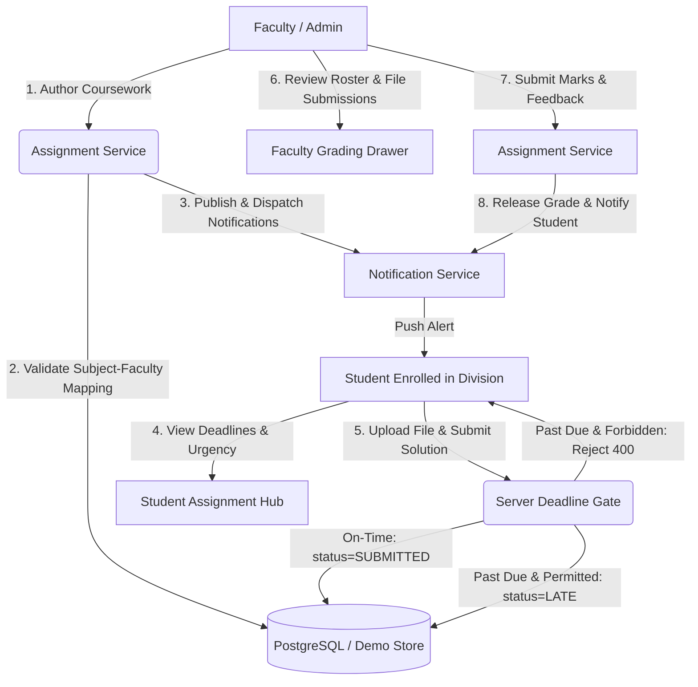

# Phase 6 — Assignment Management & Submission System

## Overview
Phase 6 delivers the production-ready **Assignment Management & Submission System** for Campus Connect. The module provides end-to-end academic coursework authoring, resource attachment management, role-scoped publishing, student submission stations with dynamic countdown timers, server-authoritative deadline evaluation, late submission handling, resubmissions, grading drawers, and Recharts analytics.

---

## 1. System Architecture

---

## 2. Database Models & Schema

The following models and enums represent the assignment domain in `prisma/schema.prisma`:

### Enums
- **`AssignmentStatus`**: `DRAFT`, `PUBLISHED`, `CLOSED`, `ARCHIVED`
- **`SubmissionStatus`**: `NOT_SUBMITTED`, `SUBMITTED`, `LATE`, `GRADED`, `RESUBMITTED`, `EVALUATED`

### Models
- **`Assignment`**:
  - `id`: UUID primary key.
  - `facultySubjectId`: Relational foreign key referencing `FacultySubject`. Ensures referential integrity between faculty, subject, division, and semester.
  - `title`, `description`, `instructions`: Coursework guidelines and problem statement.
  - `maxMarks`: Integer positive value (e.g. 100).
  - `dueDate`, `publishDate`: ISO timestamps.
  - `status`: Lifecycle state (`DRAFT`, `PUBLISHED`, `CLOSED`, `ARCHIVED`).
  - `allowLateSubmission`: Boolean toggle.
  - `latePenalty`: Percentage deduction applied to late submissions (e.g. 10%).
  - `maxFileSize`: Maximum allowed file size in bytes (e.g. 10,485,760 bytes = 10MB).
  - `allowedFileTypes`: Array of permitted extensions (e.g. `["pdf", "docx", "zip", "txt", "sql", "py"]`).
  - `attachmentUrl`, `attachments`: 1-to-many relation to `AssignmentAttachment`.
  - `submissions`: 1-to-many relation to `AssignmentSubmission`.

- **`AssignmentAttachment`**:
  - `id`, `assignmentId`, `fileName`, `fileUrl`, `fileType`, `fileSize`, `uploadedAt`.

- **`AssignmentSubmission`**:
  - `id`, `assignmentId`, `studentId`, `submittedAt`.
  - `fileUrl`, `fileName`, `fileSize`, `fileType`.
  - `submissionText`: Solution summary or notes.
  - `comments`: Optional student remarks.
  - `marksObtained`: Awarded marks (nullable until evaluated).
  - `feedback`: Faculty review remarks.
  - `isLate`: Boolean evaluated by authoritative server clock.
  - `latePenaltyApplied`: Deducted penalty percentage.
  - `version`: Version counter tracking resubmissions (default 1).
  - `status`: `SubmissionStatus` (`SUBMITTED`, `LATE`, `GRADED`).
  - `grades`: Relation to `AssignmentGrade`.

- **`AssignmentGrade`**:
  - `id`, `submissionId`, `marks`, `feedback`, `gradedBy` (relational foreign key to `User`), `gradedAt`.

---

## 3. Assignment & Submission Lifecycle

### Assignment States
1. **`DRAFT`**: Authoring in progress by mapped faculty. Visible only to author and administrator. Hidden from all students.
2. **`PUBLISHED`**: Open for student submissions. Broadcasts notification to enrolled students.
3. **`CLOSED`**: Submissions concluded. Students cannot submit or resubmit. Faculty can evaluate remaining submissions.
4. **`ARCHIVED`**: Terminated academic term records kept for institutional accreditation and audit logs.

### Submission States
1. **`NOT_SUBMITTED` / `PENDING`**: Student has not yet provided work.
2. **`SUBMITTED`**: On-time submission before deadline.
3. **`LATE`**: Submitted after deadline with late submissions enabled; late penalty recorded.
4. **`GRADED`**: Evaluated by course faculty with marks and feedback released. Work cannot be resubmitted once graded.

---

## 4. Role-Based Access Control (RBAC)

| Role | Create | Edit Own | Publish / Close | View Submissions | Submit Work | Grade |
| :--- | :---: | :---: | :---: | :---: | :---: | :---: |
| **Admin** | Yes | Yes (All) | Yes | Yes (All) | Test/Audit | Yes |
| **Faculty** | Yes (Mapped only) | Yes (Own only) | Yes (Own only) | Yes (Own only) | No (403) | Yes (Own only) |
| **Student** | No (403) | No (403) | No (403) | No (403) | Yes (Enrolled only) | No (403) |
| **Anonymous**| No (401) | No (401) | No (401) | No (401) | No (401) | No (401) |

---

## 5. Security & File Safety

1. **Executable Blacklist**: Strict rejection of `.exe`, `.bat`, `.cmd`, `.sh`, `.vbs`, `.js`, `.mjs`, `.dll`, `.bin`, `.app`, and `.jar`.
2. **Path Traversal Guards**: Filenames containing `..`, `/`, `\`, or null bytes are rejected with a 403 Security Violation.
3. **MIME / Extension Validation**: Uploaded file extensions are checked against the assignment's configured whitelist.
4. **Server-Side File Size Capping**: File sizes are validated against `maxFileSize` (10MB default) to prevent disk exhaustion.
5. **Private Access Boundaries**: Students can only access their own submissions; faculty can only access submissions belonging to their assigned courses.

---

## 6. API Endpoints

- `GET /api/assignments`: Retrieve role-filtered assignments and student KPI summary.
- `POST /api/assignments`: Create assignment (Faculty/Admin only).
- `GET /api/assignments/[id]`: Retrieve assignment details and student submission state.
- `PATCH /api/assignments/[id]`: Update assignment details.
- `POST /api/assignments/[id]/publish`: Transition assignment from `DRAFT` to `PUBLISHED`.
- `POST /api/assignments/[id]/close`: Transition assignment to `CLOSED`.
- `POST /api/assignments/[id]/submit`: Submit or resubmit coursework.
- `GET /api/assignments/[id]/submissions`: Retrieve student submission roster (Faculty/Admin only).
- `POST /api/assignments/submissions/[id]/grade`: Grade student submission (Faculty/Admin only).
- `GET /api/assignments/analytics`: Institutional and faculty assignment metrics.
- `POST /api/assignments/upload`: Secure file upload handler.

---

## 7. Demo Accounts & Credentials

- **Student Account**: `student@campusconnect.edu` / `StudentPassword@123` (Aarav Mehta, Roll No: `22COMPA101`, Division A)
- **Faculty Account**: `faculty@campusconnect.edu` / `FacultyPassword@123` (Prof. Meera Sen, DBMS & Computer Networks)
- **Admin Account**: `admin@campusconnect.edu` / `AdminPassword@123` (Dr. Rajeshwar Sharma)
