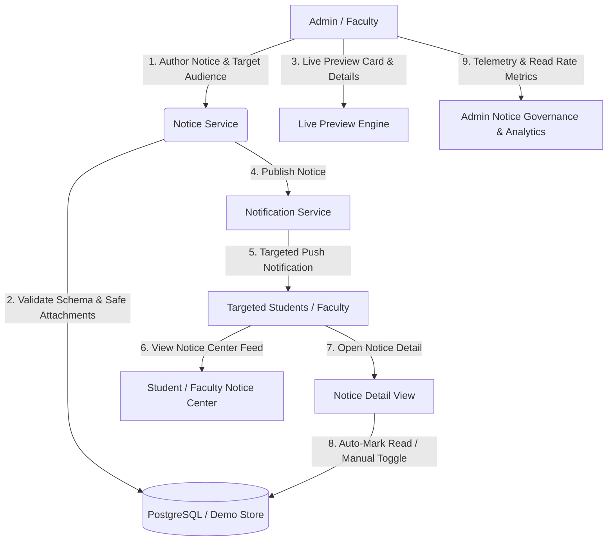

# Phase 7 — Notices, Announcements & Communication System

## Overview
Phase 7 delivers the production-ready **Institutional Notices, Announcements & Communication System** for Campus Connect. The module provides end-to-end communication lifecycle management: authoring, validation, dynamic audience targeting, live previewing, broadcasting event-driven notifications, read tracking, and real-time audience engagement analytics.

---

## 1. System Architecture



---

## 2. Database Models & Schema

Defined in `prisma/schema.prisma`:

### Enums
- **`NoticeStatus`**: `DRAFT`, `PUBLISHED`, `EXPIRED`, `ARCHIVED`
- **`NoticePriority`**: `NORMAL`, `IMPORTANT`, `URGENT`
- **`NoticeCategory`**: `ACADEMIC`, `EXAMINATION`, `ATTENDANCE`, `PLACEMENT`, `EVENT`, `CLUB`, `HOLIDAY`, `GENERAL`, `URGENT`, `ADMINISTRATIVE`
- **`NoticeAudience`**: `ALL`, `STUDENTS`, `FACULTY`, `STAFF`, `ADMIN`, `CLASS`, `DIVISION`, `DEPARTMENT`, `SEMESTER`

### Models
- **`Notice`**:
  - `id`: UUID primary key.
  - `authorId`: Relational foreign key referencing `User`.
  - `title`: Notice headline (3 to 150 characters).
  - `summary`: Short excerpt for notification badges and list cards.
  - `content`: Full circular body with formatted directives.
  - `category`: `NoticeCategory` enum.
  - `priority`: `NoticePriority` enum (`NORMAL`, `IMPORTANT`, `URGENT`).
  - `audience`: `NoticeAudience` enum.
  - `status`: `NoticeStatus` enum (`DRAFT`, `PUBLISHED`, `EXPIRED`, `ARCHIVED`).
  - Target scoping keys: `departmentId` (nullable), `classId` (nullable), `divisionId` (nullable), `semester` (nullable).
  - `publishDate`, `expiryDate`: Timestamps.
  - `attachmentUrl`: Primary attachment link.
  - `attachments`: 1-to-many relation to `NoticeAttachment`.
  - `reads`: 1-to-many relation to `NoticeRead`.

- **`NoticeAttachment`**:
  - `id`: UUID primary key.
  - `noticeId`: Relational foreign key referencing `Notice` (Cascade delete).
  - `fileName`, `fileUrl`, `fileType`, `fileSize`, `uploadedAt`.

- **`NoticeRead`**:
  - `id`: UUID primary key.
  - `noticeId`: Relational foreign key referencing `Notice`.
  - `userId`: Relational foreign key referencing `User`.
  - `readAt`: Read timestamp.
  - `@@unique([noticeId, userId])`: Ensures duplicate read records cannot exist.

---

## 3. Notice Lifecycle

The lifecycle follows strict server-authoritative state transitions:

```
[ DRAFT ]  ---> (Publish Action) --->  [ PUBLISHED ]  ---> (Expiry Date) --->  [ EXPIRED ]
    |                                        |
    +-------------> (Archive Action) <-------+
                           |
                           v
                     [ ARCHIVED ]
```

- **Drafts**: Completely invisible to students and non-author users.
- **Published**: Displayed in active feeds of users within the target audience; notifications dispatched.
- **Expired**: Evaluated dynamically when `expiryDate < now`; moved out of active feeds while remaining accessible in historical queries.
- **Archived**: Read-only archival status. Cannot be re-published without administrative intervention.

---

## 4. Audience Targeting & Scope Resolution

Targeting is resolved on the server using authenticated user claims and academic enrollment data:

| Audience | Resolution Logic |
| :--- | :--- |
| **ALL** | Visible to all students, faculty, and administrators campus-wide. |
| **STUDENTS** | Visible to all enrolled students. |
| **FACULTY** | Visible to teaching faculty and administrators. |
| **ADMIN** | Restricted to institutional administrators. |
| **DEPARTMENT** | Visible only if user's department matches `notice.departmentId`. |
| **CLASS** | Visible if student matches department, class, and semester. |
| **DIVISION** | Visible only if student's enrolled division matches `notice.divisionId`. |
| **SEMESTER** | Visible only if student's semester matches `notice.semester`. |

---

## 5. Security & RBAC Policies

- **Server-Side Enforcement**: Permissions are evaluated exclusively from session tokens and user identity on the server (`requireRole` and `NoticeService`).
- **Student Boundaries**:
  - Students cannot create notices (`HTTP 403`).
  - Students cannot edit or update notices (`HTTP 403`).
  - Students cannot publish or archive notices (`HTTP 403`).
  - Students cannot access draft notices (`HTTP 403`).
  - Students cannot view notices targeted to other departments or divisions (`HTTP 403`).
- **Faculty Boundaries**:
  - Faculty can create and publish notices for their assigned departments, divisions, or general student body.
  - Faculty cannot edit notices authored by another faculty member or administrator (`HTTP 403`).
  - Faculty cannot broadcast exclusively to administrative audiences (`HTTP 403`).
- **Attachment Protection**:
  - Whitelist: `.pdf`, `.docx`, `.doc`, `.xlsx`, `.xls`, `.pptx`, `.ppt`, `.txt`, `.png`, `.jpg`, `.jpeg`, `.webp`, `.zip`, `.tar.gz`.
  - Blocked: `.exe`, `.bat`, `.cmd`, `.sh`, `.msi`, `.vbs`, `.ps1`, `.scr`, `.jar`.
  - Path traversal (`../` or `..\`) strictly rejected (`HTTP 400`).

---

## 6. Notification System Integration

Phase 7 integrates directly with the Phase 6 `NotificationService`:
- When a notice transitions to `PUBLISHED`, `NotificationService.sendBulkNotification` pushes event-driven alerts to all targeted users.
- Alerts contain the notice title, excerpt summary, and direct deep links to `/dashboard/student/notices/[id]`.
- Notification type is explicitly mapped to `NotificationType.NOTICE`.

---

## 7. REST API Reference

| Endpoint | Method | Role | Description |
| :--- | :---: | :---: | :--- |
| `/api/notices` | GET | All | Role-scoped notice feed with search, categories, and unread metrics |
| `/api/notices` | POST | Admin/Faculty | Create notice (draft or publish) |
| `/api/notices/[id]` | GET | All | Notice detail view (auto-marks as read for recipients) |
| `/api/notices/[id]` | PATCH | Admin/Author | Update notice content or metadata |
| `/api/notices/[id]/publish` | POST | Admin/Author | Publish draft notice and dispatch notifications |
| `/api/notices/[id]/archive` | POST | Admin/Author | Archive active notice |
| `/api/notices/[id]/read` | POST | All | Manually mark notice as read |
| `/api/notices/[id]/unread` | POST | All | Toggle notice to unread state |
| `/api/notices/analytics` | GET | Admin/Faculty | High-level reach, category breakdown, and read rates |
| `/api/notices/unread-count` | GET | All | Fast unread counter for badges and omnibars |

---

## 8. Testing & Quality Gates

### Automated Vitest Suite (`tests/integration/notice.test.ts`)
- **29 dedicated Phase 7 tests** passing cleanly:
  - Validation: title, content, expiry order, malicious extensions, path traversal.
  - Audience logic: positive targeting, negative targeting, cross-department blocks.
  - Lifecycle: draft creation, publishing, archiving, transition guards.
  - Read tracking: unread counts, idempotency, auto-marking, manual toggles.
  - Security: student creation block, faculty ownership, cross-faculty tampering blocks.
  - Analytics: reach calculations, read rate percentages, category breakdowns.
- **Overall Vitest result**: 10 test files, **135/135 passing (100%)**.

### Live HTTP Verification (`scripts/verify-api.mjs`)
- **32 dedicated live HTTP checks** targeting production server daemon:
  - Full CRUD operations, permission guards, draft invisibility, live publishing, auto-read triggers, and unread toggles.
- **Overall live API result**: **138/138 PASSED (0 failed)**.

### Build & Type Verification
- `npm run type-check`: 0 errors.
- `npm run build`: 49/49 static and dynamic routes compiled with 0 errors.

---

## 9. Known Limitations
- Rich text currently uses standard Markdown formatting with newline rendering rather than a full WYSIWYG editor.
- Attachments are referenced via validated public URLs / downloads; cloud S3/GCS bucket signing can be integrated in subsequent infrastructure passes.
